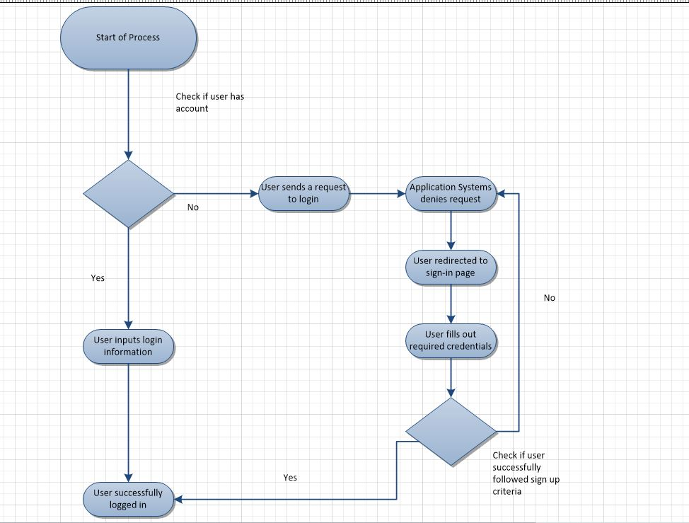

= CIS 4339 Semester Project Fall 2017
:toc: left

= Overview
*This is our Asciidoctor documentation website. Here you will find all of the required deliverables based on the instructions provided.* 

== Design Documentation

==== Full UML model

image::C:\Users\jonat\OneDrive\Fall2017\CIS4339\RailsDocumentation\uml.JPG[800,600]

==== UML Activity diagrams

*Activity Diagram #1* +
*Purpose*: An activity diagram for a new user login +
*Summary/Operation*: New user begins usage of new application. User attempts to sign up, fill in credentials, and create an account.

 

*Activity Diagram# 2*: +
*Purpose*: An activity diagram for users to create/choose a channel +
*Summary/Operation*: New user begins usage of application, logs in, decides if they want to create a channel or refer to a previous channnel, and create a channel. +

image::activity2.jpg[] 

== User Manual

=== 1. About 
1.1	Purpose:: 
	This guide provides guidelines and step-by-step instructions for working with the intranet discussion board.
1.2	Who should use this guide::
	This guide is intended for end-users of the discussion board.
1.3	About discussion board::
	The discussion board is an interactive messaging board used for internal communications. The messaging board allows end-users to properly organize and search discussions with an organization. 
	
	
	
	

===  2. Login/Create Page
2.1	Overview::
	
	The login page is presented to users when accessing the web interface. Apart from the log in controls, a create log in and a ‘forgot password’ link are available. 
2.2	 Create Login::

	New users will click the sign up link to prompt you to a page to create a log in. Here you will input an email and password (_minimum 6 characters_) of your choosing to create your account to log in to the previous page. +

`_Sign up page_`: should be accessed if you have not yet created an account  +

image::signuplogin.jpg[800,600]

`_Sign up error_`: if you entered an email address that is already in the system  +

image::signuperror.jpg[800,600]

`_Login page_`: should be accessed once a new account has been created (or if you have an existing account) +

image::firstpagelogin.jpg[800,600] 

		
2.3	Forgot password::
	Users who have lost or forgotten their password should click on the link provided to the *forgot password* page where you will then input the users email to have the system send you the missing password. +
	
image::forgotpassword.jpg[800,600]

	
	
	
=== 3. Navigation Bar
3.1	Home::
	Directs you to the home page, showing all the different channels created. +

image::homeindex.jpg[800,600]	
	
	
3.2	Search::
	Text input field used to search for words that match within the posts and comments. 
3.3	Sign out::
	Link that directs you back to the log in page, logging you out of your account.
	
	
image::signout.jpg[800,600]
	
	
	
	

=== 4. Channels 
4.1 Navigation::
	Click on the home page link in the navigation bar to display the homepage comprised of the created channels.	+
	
image::channelspage.jpg[800,600]
	
	
4.2 Channel creation::
	Click on the ‘create channel’ link to direct you to the channel creation display. Here you fill in the required information needed to create a channel. +
	
image::newchannel.jpg[800,600]
	
4.3 Existing channel:: 
	Click on an already existing channel to either edit it or post within. +
		
	

=== 5. Posts
5.1 Navigation::
	From the home page you will click on an already existing channel to access the posts.

image::C:\Users\jonat\OneDrive\Fall2017\CIS4339\RailsDocumentation\navpostt.JPG[800,600]

5.1 Post creation:: 
	Click on the 'New Post' link to direct you to the post creation display. Here you will fill out the required information to display your post.

image::C:\Users\jonat\OneDrive\Fall2017\CIS4339\RailsDocumentation\newpost.JPG[800,600]

5.2 Existing post::
	Click on the already existing post to either edit it or post a comment.

image::C:\Users\jonat\OneDrive\Fall2017\CIS4339\RailsDocumentation\existingpost.JPG[800,600]
	
	

=== 6. Comments
6.1 Navigation::
	From the homepage you will click on an existing channel then click on an existing post to access the comment sections.

image::C:\Users\jonat\OneDrive\Fall2017\CIS4339\RailsDocumentation\comments.JPG[800,600]
	

== Post-Mortem

We believe that, overall, the project went well. There were definitely many instances of trial and error. This was crucial in developing an application we believe is intuitive and functional. The biggest challenges we faced were getting the gems to co-exist properly. This project forced us to search for gems, read their documentation, and make a decision on whether or not they fit into our project. The collaboration that took place between team members was something that was of great importance to us. Without it, the project's timely and adequate completion would have been difficult at best. 

===== Areas of Improvement 
Some of the areas we believe we could improve on is our delegation of tasks. We found that some members were better suited for some tasks than others. However, we were able to figure this out fairly quickly and complete deliverables in areas of our strengths. This proved to be highly successful since people were completing deliverables confidently.
